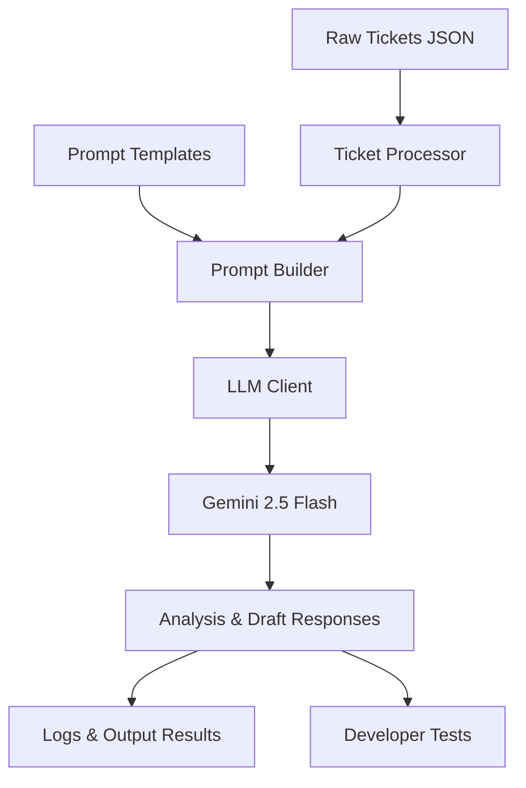

# AI Support Copilot — Step 1: Project Initialization & Core LLM Integration

Welcome to the **AI Support Copilot** progress tracking repository. This document serves as **Step 1** of our project documentation, detailing the overall workflow, progress achieved so far, and the architecture established to support automated, AI-powered customer support ticket analysis and resolution.

---

## 📖 Project Overview

**AI Support Copilot** is designed to streamline customer support operations by leveraging Gemini large language models. The copilot automatically ingests raw customer tickets, analyzes customer sentiment, evaluates the urgency, summarizes complex issues, and builds drafted, context-aware email responses for support agents.

---

## 🔄 Overall Project Workflow

The architecture of the application is designed to be modular and scalable. Below is the workflow diagram representing how data traverses through the copilot:

### Component Details
1. **Raw Tickets Intake (`sample_data/support_tickets.json`)**: Contains raw customer issues (e.g., ticket ID, subject, body, customer name, date).
2. **Ticket Processor (`app/ticket_processor.py`)**: Responsible for reading the tickets from disk, parsing the payload, and preparing them for processing.
3. **Prompt Builder (`app/prompt_builder.py`)**: Merges the ticket contents with highly engineered prompt templates from the `prompts/` directory to tailor instructions for specific actions (e.g., sentiment extraction, urgency categorizing, summarization, response drafting).
4. **LLM Client (`app/llm_client.py`)**: Interacts with the Gemini model using the latest standard Google GenAI SDK.
5. **Execution Orchestrator (`app/main.py`)**: Runs the pipeline, coordinating data flow between components and displaying/saving the output.
6. **Logging and Utilities (`logs/` & `app/utils.py`)**: Provides robust logging of actions and standard utility functions for error handling and formatting.

---

## 🛠️ Step 1 Progress: What Has Been Done

We have successfully completed **Step 1** of the implementation, focusing on establishing the infrastructure, configuration, core SDK integration, and verify basic communication with Gemini.

Here is the itemized list of progress:

### 1. Repository & Directory Structure Setup
We established the standard directory tree for the project:
*   `app/` — Contain python logic for execution, configuration, prompting, processing, and utilities.
*   `prompts/` — Placeholder for highly descriptive prompts (summarization, sentiment, urgency, response generation).
*   `sample_data/` — Holds target support tickets dataset.
*   `tests/` — Dedicated space for unit tests.
*   `logs/` — Holds runtime log files.
*   `docs/` — **[NEW]** Created to store running documentation and progress reports.

### 2. Core Dependencies & Environment Configuration
*   Configured [`requirements.txt`](file:///d:/\#CodexProjects/ai-support-copilot/requirements.txt) with essential libraries:
    *   `python-dotenv`: To manage secure API keys and model configurations locally.
    *   `google-genai`: Utilizing the modern Google GenAI Python SDK.
*   Created [`.env`](file:///d:/\#CodexProjects/ai-support-copilot/.env) containing configurations for:
    *   `MODEL_NAME` (e.g., `gemini-2.5-flash` or similar)
    *   `GOOGLE_API_KEY` (secret key)
*   Implemented [`app/config.py`](file:///d:/\#CodexProjects/ai-support-copilot/app/config.py) to load environment variables cleanly across the application context.

### 3. Core LLM Client Implementation
*   Implemented [`app/llm_client.py`](file:///d:/\#CodexProjects/ai-support-copilot/app/llm_client.py):
    *   Imports modern `google.genai` Client.
    *   Initializes the Client with the loaded API key and model name.
    *   Exposes a robust `generate_response(prompt: str) -> str` method with error boundaries.

### 4. Basic Pipeline Verification
*   Implemented [`app/main.py`](file:///d:/\#CodexProjects/ai-support-copilot/app/main.py) to serve as a proof-of-concept runner.
*   Successfully ran a basic customer support issue summarization prompt through the LLMClient:
    *   *Prompt:* "Summarize this customer support issue professionally: 'I was charged twice during checkout and still didn't receive my premium subscription.'"
    *   *Result:* Confirmed successful generation by outputting the Gemini model's response.

### 5. Version Control Integration
*   Tracked all changes with Git.
*   Successfully added, committed, and pushed the base setup to the main branch of the GitHub repository: `https://github.com/SirWalsong/ai-support-copilot.git`.

---

## 🚀 Next Steps (Future Milestones)

With the foundation successfully established in **Step 1**, we will move forward to build:
1.  **Support Tickets Dataset**: Populate `sample_data/support_tickets.json` with comprehensive mock support tickets.
2.  **Prompt Engineering Templates**: Construct templates for sentiment analysis, urgency analysis, summarization, and customer response in `prompts/`.
3.  **Ticket Processor & Prompt Builder Logic**: Implement code in `app/ticket_processor.py` and `app/prompt_builder.py` to pull everything together.
4.  **Logging & Testing Infrastructure**: Set up logging to `logs/app.log` and draft automated tests in `tests/test_processor.py`.
