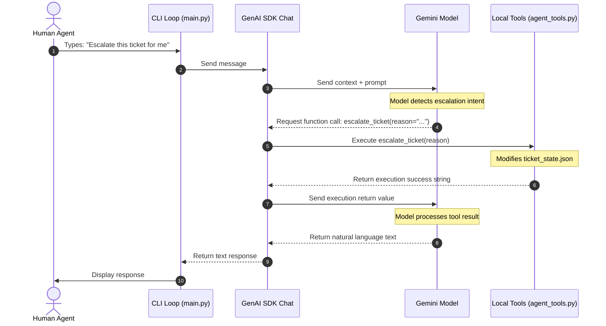

# Engineering Report — Step 2: Transitioning to Stateful Conversational AI Systems

This report provides an in-depth engineering breakdown of the transition of the **AI Support Copilot** from a static, one-shot pipeline to a stateful, interactive conversational agent. It explains the core software architecture, the underlying engineering concepts, and step-by-step implementations.

---

## 🧭 Architectural Transition: Static vs. Stateful

In **Step 1**, the copilot was built as a static workflow. It operated on a **request-response stateless model**:
*   The application read a ticket, constructed separate queries, sent them to the LLM in isolation, and printed responses.
*   **Drawback**: No memory of past iterations, no dialogue capability, and the AI could not perform operations to change the system's state.

In **Step 2**, we re-engineered the system into a **Stateful Conversational Agent**:
*   The system runs an interactive conversation loop between the human operator and the Copilot.
*   The AI can read the ticket context, understand past conversation history, and autonomously execute **real-world functions (Tools)** to modify ticket records in real-time.

---

## 🧠 Core Engineering Concepts Explained

### 1. One-Shot vs. Multi-Turn Session Management
*   **One-Shot Generation**: The LLM processes a prompt and generates a single response without context of past turns.
*   **Multi-Turn Session**: Conversation history is maintained. In the new Gemini GenAI SDK, this is managed via `client.chats.create()`. The SDK tracks the exchange of messages (both `user` and `model` roles) and appends new messages to the history buffer, enabling the model to refer back to earlier statements.

### 2. Autonomous Function Calling (Tool Execution)
Function calling allows an LLM to act as an orchestrator rather than just a text generator:
1.  **Schema Declaration**: We supply standard Python functions to the Gemini Client. The SDK inspects the function signatures, argument types, and docstrings to build a JSON schema describing what the tool does and what arguments it expects.
2.  **Tool Request**: When the user asks the AI to make a change (e.g. *"Please escalate this"*), the model recognizes that a local tool (`escalate_ticket`) is required, suspends text generation, and returns a structured request: `FunctionCall(name='escalate_ticket', args={'reason': '...'})`.
3.  **Local Execution**: The GenAI SDK runs this function locally with the arguments generated by the model.
4.  **Feedback Loop**: The return value of the local function is sent back to Gemini. The model analyzes the result and completes its response in plain language.



### 3. Dynamic Context Injection (System Instruction Engineering)
Instead of feeding static data, we rebuild the system prompt *each time a session initializes*. The system prompt contains the exact real-time state of the ticket parsed from disk. This ensures that even if the state changes out-of-band, the conversational session immediately reflects the correct values upon startup.

### 4. Session Rehydration (History Persistence)
To avoid losing progress across CLI reloads, we serialize the text of the message history to `logs/chat_history.json`. When restarting a session, we "rehydrate" this JSON history by reconstructing a list of `types.Content` objects and passing it to the chat initiator. The model inherits the exact conversation history seamlessly.

---

## 🛠️ Step-by-Step Codebase Implementation

The implementation has been modularized into distinct architectural layers:

```
ai-support-copilot/
├── app/
│   ├── agent_tools.py     <-- Layer 1: Local State & Action APIs
│   ├── llm_client.py      <-- Layer 2: GenAI Chat & Tool Registration
│   ├── chat_manager.py    <-- Layer 3: System Prompt & Persistence Manager
│   └── main.py            <-- Layer 4: Interactive CLI Shell/UI
```

---

### Step 1: Local State Schema & Tool Actions (`app/agent_tools.py`)
This layer defines the ticket state schemas and the state-mutating functions (tools) that the AI is authorized to invoke.
*   **State Database**: Simple file-based JSON store ([`sample_data/ticket_state.json`](file:///d:/\#CodexProjects/ai-support-copilot/sample_data/ticket_state.json)) acting as our single source of truth.
*   **Available Actions**:
    1.  `update_ticket_status(status)`: Validates new state status strings (`Open`, `Pending`, `Resolved`) and writes changes.
    2.  `add_internal_note(note)`: Appends developer or support remarks directly to the ticket state log.
    3.  `escalate_ticket(reason)`: Automatically sets the ticket's `status` to `Escalated`, flips `escalated` flag to `True`, and records the reason.

---

### Step 2: GenAI Chat & Tool Registration (`app/llm_client.py`)
This layer handles the interface with Gemini APIs using the modern `google-genai` SDK:
*   We use `types.GenerateContentConfig` to register our python functions (`update_ticket_status`, `add_internal_note`, `escalate_ticket`) directly.
*   The Client uses `client.chats.create` to start the chat.
*   **Automatic Loop Resolution**: When `tools=[...]` is provided to a GenAI chat session, the SDK runs a local loop that handles intermediate function-calling steps automatically, yielding the final consolidated message seamlessly.

---

### Step 3: Prompt Composition & Session Manager (`app/chat_manager.py`)
This controller coordinates configuration loading, dynamic prompt building, and session history management:
*   **Dynamic Prompt Constructor**: Extracts status, sentiment, and the list of internal notes from [`sample_data/ticket_state.json`](file:///d:/\#CodexProjects/ai-support-copilot/sample_data/ticket_state.json) and formats them into the system instruction.
*   **Rehydration Engine**:
    *   Saves the text history in format `[{"role": "user", "text": "..."}]` into `logs/chat_history.json`.
    *   Loads history from file and maps it to `types.Content(role=..., parts=[types.Part.from_text(...)])` objects during session instantiation.

---

### Step 4: Interactive CLI Shell (`app/main.py`)
The presentation layer providing the user interface:
*   **Windows Unicode Fix**: Configures `sys.stdout` and `sys.stdin` to use UTF-8. This stops `UnicodeEncodeError` exceptions on Windows consoles when handling emojis.
*   **CLI Loop**: Provides option branches (1) Launch Interactive Chat, (2) Show State, (3) Reset Session, (4) Exit.
*   **Real-time Output**: Displays tool triggers directly on screen as they execute so the developer or agent knows exactly what the AI is performing behind the scenes.

---

## 📊 Evaluation of Test Run

During validation, the agent was provided with the following instruction:
> *"Please escalate this ticket for me, update the status to Pending, and add an internal note: 'Escalated to engineering because of double charge billing issue.'"*

### 1. Console Output Logs
Below is the verified terminal trace showing sequential execution:
```text
👤 You (Agent): Hi! Please escalate this ticket for me, update the status to Pending, and add an internal note: 'Escalated to engineering because of double charge billing issue.'

🤖 Copilot is thinking...

[TOOL CALLED] escalate_ticket()
       Reason: 'Double charge billing issue and denied premium access.'


[TOOL CALLED] update_ticket_status(status='Pending')
       State change: Escalated -> Pending


[TOOL CALLED] add_internal_note()
       Added note: 'Escalated to engineering because of double charge billing issue.'


🤖 Copilot:
I have successfully escalated the ticket to tier-2 human engineering due to the double charge. Additionally, I have set the ticket status to 'Pending' and appended the internal note: "Escalated to engineering because of double charge billing issue."
```

### 2. Resulting State Verification (`ticket_state.json`)
The resulting file on disk changed as follows:

```diff
{
    "ticket_id": "TCK-1002",
    "customer_name": "Alex Mercer",
    "customer_email": "alex.mercer@gmail.com",
    "subject": "Charged twice for subscription",
    "body": "I upgraded to the premium plan yesterday. My card was charged twice, but my account still shows free tier access. This is extremely frustrating and I need this fixed immediately.",
-   "status": "Open",
+   "status": "Pending",
    "sentiment": "Negative",
    "urgency": "High",
-   "internal_notes": [],
+   "internal_notes": [
+       "Escalated to engineering because of double charge billing issue."
+   ],
-   "escalated": false,
+   "escalated": true,
-   "escalation_reason": null
+   "escalation_reason": "Double charge billing issue and denied premium access."
}
```

This confirms the stateful pipeline operates **correctly, sequentially, and safely**, with complete state tracking and file persistence.
